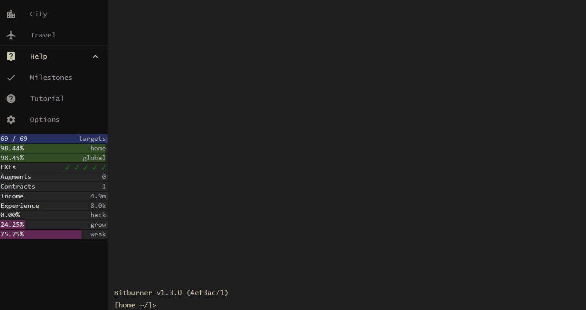
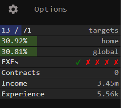
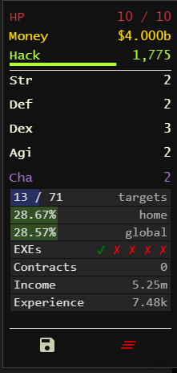
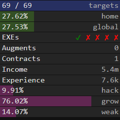

# bitburner-status-overlay
A simple statusbar library for bitburner



See [sample_overlay.js](sample_overlay.js) for a working out of the box, general example.

The overlay is customizable, allowing you to add status bars for things you care about without much hassle.

In the spirit of the game, please fork this and do whatever you want with it.  I can't make any promises about my ability to support the project.  I probably won't even see github notifications because this isn't my main (work-related) github account.  But I'll do my best.

## Examples and Locations
* **Location: 'drawer'**



* **Location: 'stats'**



* **My current overlay, with a few more bars for various things:**



## Controlling status bars from external/additional scripts:
For things that you always want to see, the code for updating the bars should probably go in your
main "overlay.js" script (see [example_overlay.js](sample_overlay.js)).

But what if you want an external script to control a bar?

That's supported too.  You want something like this

```js
// Imports
import { StatusBarText } from '/lib/ui/StatusBar.js'
import { StatusContainer } from '/lib/ui/StatusContainer.js'

// See the note in sample_overlay.js about accessing document this way
const doc = document

// Get a reference to your container and create a statusbar
let container = new StatusContainer(doc)
let statusbar = new StatusBarText(doc, {divId:"WorkStatus", container})

// Setup an atExit handler to remove the bar when this script ends
ns.atExit(() => {
    statusbar.remove()
})

while(<whatever>){
    // do your work
    statusbar.ensureContainer(doc, container)
    statusbar.rlabel = estTimeRemaining  // Or whatever you want to show here
}
```
